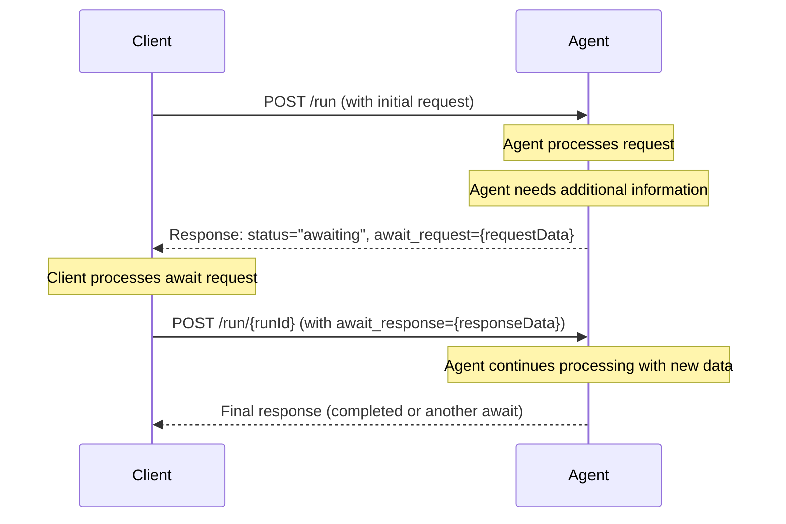

import AlphaWarning from "/snippets/alpha-warning.mdx";

<AlphaWarning />

Agent communication typically involves interactions between two parties, one of which is always an agent, while the other may be another agent, a human interacting through the UI, or a system interacting via an API.

We refer to the party interacting with the agent as the Client.

Communication typically follows a request-response pattern. For example, the Client requests an action from the agent and expects a response upon completion.

However, there are cases where the agent requires additional input or actions from the Client to proceed. Examples include confirming if a selected restaurant is acceptable or verifying geolocation data provided by the user's browser. This interaction is managed through a mechanism called **Awaits**, enabling the agent to pause execution until the required input or action is provided.

Awaits are conceptually similar to "Human in the loop," but more abstract, aligning with ACP since the Client does not need to be human.

In the protocol, an **Await** is represented by returning a run status of awaiting. The Client resumes the run by providing the payload needed to resolve the Await.

