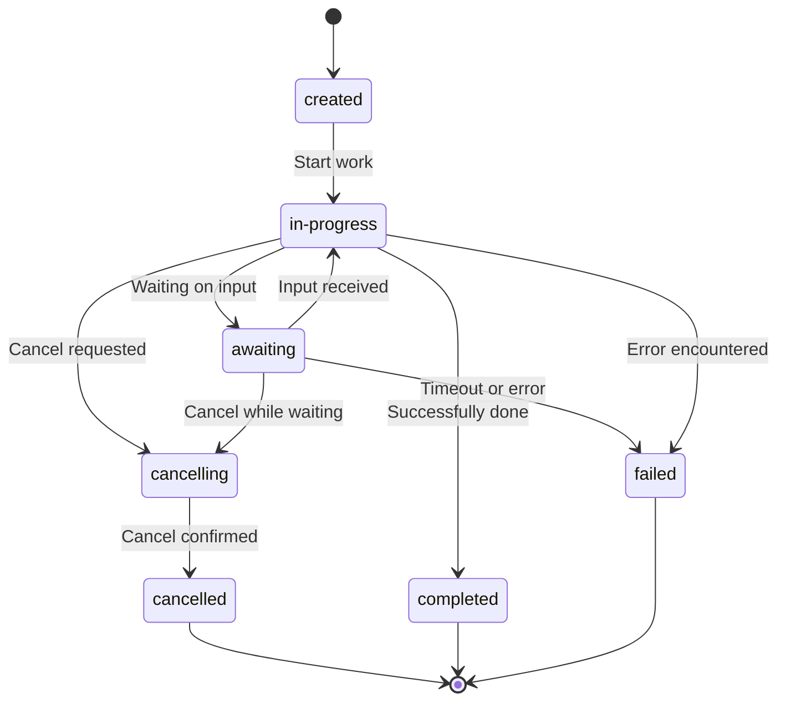

import AlphaWarning from "/snippets/alpha-warning.mdx";

<AlphaWarning />

## How Agent Runs Work In ACP

ACP offers the resource "Agent Run" for managing agent states. Agent Runs can be initiated by `POST /runs`, resumed by `POST /runs/{run_id}`, and cancelled by `/runs/{run_id}/cancel` (note that ACP does not use DELETE here since cancellation is an asynchronous operation).

For different types of agents, an Agent Run may mean different things:

- **Stateless agents** don't support holding a conversation, thus the Agent Run represents only a single call and its result.
- **Serializable stateful agents** can save their state to a persistent storage, allowing for the Agent Run to continue virtually anytime.
- **Non-serializable stateful agents** depend on a non-serializable resource, like a running Jupyter kernel, and thus their Agent Run has a short expiration time -- _expired_ Agent Run can't be continued further.

From the point of agent implementation, most of the heavy lifting around state management is handled by the SDK. The agent creator / integrator must only decide what type of statefulness is right for the given agent, and properly wire it to the agent implementation: creating a new instance or retrieving an existing one where appropriate.

### Run states

Each Agent Run starts in the `created` state. After receiving input, it moves to the `in-progress` state. While in-progress, the agent can optionally await some external input, in which case it goes to `awaiting` and returns back to `in-progress` after receiving the input. After a successful execution, `in-progress` turns into a terminal state `completed`. A run that's `in-progress` or `awaiting` can be cancelled, in which case it first goes to `cancelling` and then a terminal state `cancelled`. Finally, an error may occur, in which case the agent state becomes a terminal state `failed`.

Depending on agent implementation, the run could be continued, in which case it may return to the `in-progress` state from one of the terminal states.

