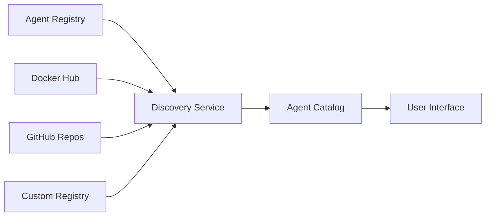
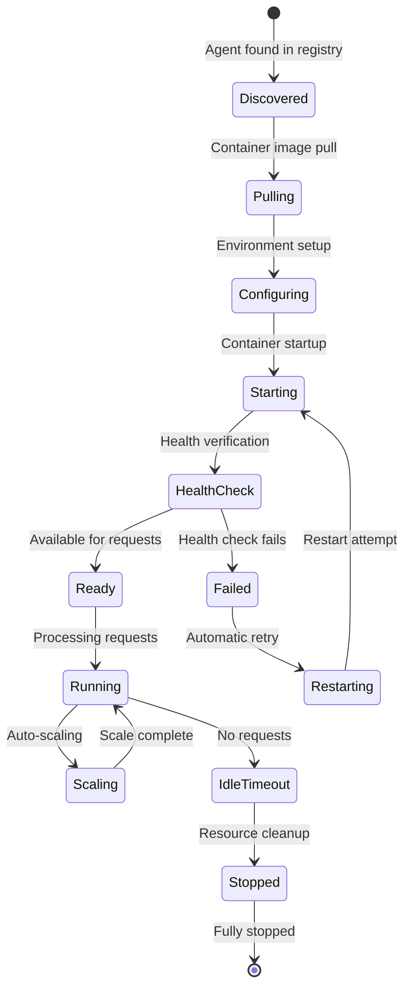

# Understanding Agents

Agents are at the core of the BeeAI platform. They represent autonomous components that can perform specific tasks, process information, or interact with users. This document explains agent concepts, their structure, and how they function within the BeeAI ecosystem.

## What are Agents?

In BeeAI, an agent is a self-contained module that:

- Implements the [Agent Communication Protocol](https://agentcommunicationprotocol.dev/) (ACP)
- Has clearly defined inputs and outputs
- Performs a specific function or set of related functions
- Can operate independently or as part of a composition
- Is packaged as a Docker container

Conceptually, agents can be thought of as specialized "workers" that excel at specific tasks, from simple operations like text summarization to complex workflows like research, content generation, or data analysis.

## Agent Architecture

Every agent in BeeAI has these common components:

### 1. Agent Interface

The interface defines how the agent communicates with the outside world through:

- **Input Schema**: Defines the expected input format
- **Output Schema**: Specifies the structure of the agent's response
- **Metadata**: Information about the agent's capabilities, requirements, and usage

### 2. Agent Logic

The core functionality of the agent, which can include:

- Processing input data
- Making API calls to external services
- Using language models for text generation
- Utilizing specialized tools (search, weather, etc.)
- Performing computations or data analysis

### 3. Container Runtime

All agents run in containerized environments (Docker), ensuring:

- Consistent execution across different platforms
- Isolation from the host system and other agents
- Dependency management
- Scalability and reproducibility

## Agent Types

BeeAI supports various types of agents:

### By Interaction Pattern

- **Chat Agents**: Conversational agents designed for back-and-forth interaction with users
- **Hands-Off Agents**: Single-purpose agents that process input and produce output without intermediate steps
- **Custom UI Agents**: Agents with specialized interfaces for specific use cases

### By Framework

- **BeeAI Framework Agents**: Built using the official [BeeAI Framework](https://github.com/i-am-bee/beeai-framework)
- **Community Framework Agents**: Built with frameworks like LangChain, CrewAI, LlamaIndex, etc.
- **Custom Agents**: An agent implementation that implements ACP protocol built with potentialy any framework

### By Purpose

- **Tool Agents**: Perform specific operations like search, data processing, or code generation
- **Assistant Agents**: Provide conversational help and information to users
- **Composer Agents**: Coordinate the execution of multiple agents (like sequential_workflow)
- **Domain-Specific Agents**: Specialized for particular fields like legal, medical, or financial tasks

## Agent Metadata

Agent metadata provides essential information about an agent, including:

- **Name**: Unique identifier for the agent
- **Description**: Brief summary of the agent's purpose
- **Documentation**: Detailed explanation of how the agent works
- **Framework**: The framework or technology used to build the agent
- **Examples**: Sample usage and expected outputs
- **Environment Variables**: Configuration options for the agent
- **UI Type**: How the agent should be presented in the user interface
- **Links**: References to source code, documentation, etc.

Here's an example of agent metadata:

```yaml
name: chat
description: AI-powered conversational system with memory and tools
metadata:
  programming_language: Python
  license: Apache 2.0
  framework: BeeAI
  documentation: |
    The agent is an AI-powered conversational system designed to process user messages,
    maintain context, and generate intelligent responses...
  ui:
    type: chat
    user_greeting: How can I help you?
  examples:
    cli:
      - command: 'beeai run chat "What is the weather like in Paris?"'
        name: With tools
        description: Run agent with tools.
        output: The current temperature in Paris is 12°C with partly cloudy skies.
  env:
    - name: LLM_MODEL
      description: Model to use from the specified OpenAI-compatible API.
    - name: LLM_API_BASE
      description: Base URL for OpenAI-compatible API endpoint
    - name: LLM_API_KEY
      description: API key for OpenAI-compatible API endpoint
```

## Standardized Agent Interfaces

BeeAI provides standardized UI patterns for agent interaction:

### Chat Interface

Designed for conversational agents:
- Full conversation history and context
- Message-by-message interaction
- Streaming responses
- Suitable for assistants and complex interaction flows

### Hands-Off Interface

For single-input, single-output agents:
- One input field for the user request
- Processes the request and returns a complete response
- No intermediate interaction
- Suitable for transformation, generation, or analysis tasks

### Custom Interfaces

For specialized agent requirements:
- JSON input interface for complex data structures
- Custom visualizations
- Application-specific UI elements

## Agent Lifecycle

The lifecycle of a BeeAI agent includes these stages:

1. **Discovery**: Agents are found in the registry or from custom sources
2. **Installation**: Agents are downloaded and installed locally
3. **Configuration**: Required environment variables are set
4. **Execution**: The agent runs in response to user requests
5. **Updating**: Agents are updated to newer versions as needed
6. **Removal**: Agents can be uninstalled when no longer needed

## Agent Management

BeeAI provides tools for managing agents:

- **Listing Agents**: `beeai list` shows all available agents
- **Installing**: `beeai install <name>` installs an agent
- **Running**: `beeai run <name> [input]` executes an agent
- **Inspecting**: `beeai info <name>` shows agent details
- **Viewing Logs**: `beeai logs <name>` displays agent logs
- **Removing**: `beeai remove <name>` uninstalls an agent

## Creating Agents

To create your own agent:

1. Choose a development framework (BeeAI Framework, LangChain, etc.)
2. Implement the agent logic following the ACP standard
3. Package the agent as a Docker container
4. Test the agent locally
5. Share the agent with others

See [Building Agents](/how-to/build-agents) for detailed instructions.

## Next Steps

- [Run agents](/how-to/run-agents) locally
- [Compose agents](/how-to/compose-agents) into workflows
- [Explore the agent catalog](/agents/official-list)
- [Build your own agents](/how-to/build-agents)

---

---

---

---
description: "Understand AI agents in BeeAI: types, capabilities, lifecycle management, and how they work across different frameworks through the ACP protocol."
---

# Agents

In BeeAI, agents are self-contained AI programs that can perform specific tasks or engage in conversations. What makes BeeAI unique is that agents from any framework - CrewAI, LangChain, AutoGen, or custom implementations - all work seamlessly together through the Agent Communication Protocol (ACP).

## What Are Agents?

An **agent** in BeeAI is an AI program that:

- **Accepts input** in natural language or structured formats
- **Processes requests** using AI models and custom logic
- **Produces output** such as text, files, or structured data
- **Runs independently** in its own containerized environment
- **Communicates** through the standardized ACP protocol

### Agent vs. Traditional Software

| Traditional Software | BeeAI Agents |
|---------------------|--------------|
| Fixed, programmed responses | Dynamic, AI-powered responses |
| Rigid input/output formats | Natural language interaction |
| Single-purpose functions | Adaptable task handling |
| Manual integration required | Universal ACP compatibility |

## Agent Types by Interface

### Chat Agents

Interactive agents that maintain conversation context and support back-and-forth dialogue.

**Characteristics:**
- Persistent conversation memory
- Interactive user interface
- Real-time streaming responses
- Context-aware responses

**Example Usage:**
```bash
beeai run chat
>>> Hello, how can you help me?
I'm an AI assistant ready to help with questions, analysis, writing, and more...
>>> Can you explain quantum computing?
Certainly! Quantum computing is a revolutionary approach to computation...
>>> How does it differ from classical computing?
Great follow-up question! The key differences are...
```

**Use Cases:**
- General assistance and Q&A
- Interactive problem-solving
- Educational conversations
- Customer support scenarios

### Hands-off Agents

Task-focused agents that take a single instruction and work autonomously to complete it.

**Characteristics:**
- Single input, complete output
- Autonomous task execution
- Progress indicators during work
- Comprehensive final results

**Example Usage:**
```bash
beeai run research-assistant "Research the latest developments in renewable energy"
🔍 Gathering information from sources...
📊 Analyzing data patterns...
📝 Generating comprehensive report...
✅ Research complete! Generated files: renewable_energy_report.pdf
```

**Use Cases:**
- Research and analysis tasks
- Content generation
- Code review and analysis
- Report creation

### Workflow Agents

Meta-agents that orchestrate multiple other agents to complete complex, multi-step tasks.

**Characteristics:**
- Orchestrates multiple agents
- Manages data flow between steps
- Handles different completion times
- Combines outputs intelligently

**Example Usage:**
```bash
beeai run sequential-workflow
# Interactive setup:
# Step 1: research-assistant "Research AI trends"
# Step 2: document-creator "Create executive summary"
# Step 3: presentation-maker "Create slides"
```

**Use Cases:**
- Complex business processes
- Multi-stage content creation
- Data processing pipelines
- Automated reporting workflows

## Agent Types by Framework

### CrewAI Agents

Agents built using the CrewAI framework, designed for collaborative multi-agent workflows.

**Example Agent:**
```python
from crewai import Agent, Task, Crew
from acp_sdk.server import create_server

def run_crew_agent(input_text):
    researcher = Agent(
        role='Senior Research Analyst',
        goal='Uncover cutting-edge developments',
        backstory='Expert in analyzing complex topics'
    )
    
    task = Task(
        description=input_text,
        agent=researcher
    )
    
    crew = Crew(agents=[researcher], tasks=[task])
    return crew.kickoff()

server = create_server(
    name="crewai-researcher",
    description="Research agent built with CrewAI",
    agent_callable=run_crew_agent
)
```

**Strengths:**
- Multi-agent collaboration
- Role-based agent design
- Built-in task management
- Hierarchical workflows

### LangChain Agents

Agents leveraging LangChain's extensive ecosystem of tools and integrations.

**Example Agent:**
```python
from langchain.agents import create_react_agent
from langchain_openai import ChatOpenAI
from langchain.tools import DuckDuckGoSearchRun
from acp_sdk.server import create_server

def run_langchain_agent(input_text):
    llm = ChatOpenAI()
    tools = [DuckDuckGoSearchRun()]
    agent = create_react_agent(llm, tools, prompt)
    return agent.invoke({"input": input_text})

server = create_server(
    name="langchain-researcher",
    description="Research agent with web search",
    agent_callable=run_langchain_agent
)
```

**Strengths:**
- Extensive tool ecosystem
- Memory management
- Chain composition
- Vector database integration

### AutoGen Agents

Agents built with Microsoft's AutoGen for multi-agent conversations.

**Example Agent:**
```python
import autogen
from acp_sdk.server import create_server

def run_autogen_agent(input_text):
    config_list = [{"model": "gpt-4", "api_key": "..."}]
    
    assistant = autogen.AssistantAgent(
        name="assistant",
        llm_config={"config_list": config_list}
    )
    
    user_proxy = autogen.UserProxyAgent(
        name="user_proxy",
        human_input_mode="NEVER"
    )
    
    user_proxy.initiate_chat(assistant, message=input_text)
    return assistant.last_message()["content"]

server = create_server(
    name="autogen-assistant",
    description="Multi-agent conversation with AutoGen",
    agent_callable=run_autogen_agent
)
```

**Strengths:**
- Multi-agent conversations
- Human-in-the-loop capabilities
- Code execution environment
- Group chat coordination

### Custom Framework Agents

Agents built with custom frameworks or from scratch, tailored for specific use cases.

**Example Agent:**
```python
from acp_sdk.server import create_server
import openai

class CustomAnalysisAgent:
    def __init__(self):
        self.client = openai.OpenAI()
        self.analysis_prompt = """
        You are a data analysis expert. Analyze the provided data
        and generate insights with visualizations.
        """
    
    def process(self, input_text):
        response = self.client.chat.completions.create(
            model="gpt-4",
            messages=[
                {"role": "system", "content": self.analysis_prompt},
                {"role": "user", "content": input_text}
            ]
        )
        return response.choices[0].message.content

agent = CustomAnalysisAgent()

server = create_server(
    name="custom-analyzer",
    description="Custom data analysis agent",
    agent_callable=agent.process
)
```

**Strengths:**
- Complete control over behavior
- Optimized for specific tasks
- Minimal dependencies
- Custom integration capabilities

## Agent Lifecycle

### Discovery Phase

Agents become available through various discovery mechanisms:



**Sources:**
- **Official Registry:** Curated agents from BeeAI team
- **Community Registry:** Community-contributed agents
- **Docker Registries:** Public and private container registries
- **GitHub Repositories:** Source code repositories with agent definitions
- **Custom Registries:** Enterprise and organizational agent repositories

### Installation and Deployment

When an agent is first requested, BeeAI handles the complete deployment process:



### Resource Management

**Automatic Scaling:**
- **Scale Up:** Agents start when first requested
- **Scale Out:** Multiple instances for high demand
- **Scale Down:** Automatic shutdown after idle period
- **Resource Limits:** CPU, memory, and storage quotas

**Health Monitoring:**
- **Liveness Probes:** Detect unresponsive agents
- **Readiness Probes:** Ensure agents are ready for requests
- **Performance Metrics:** Response times and success rates
- **Automatic Recovery:** Restart failed agents

## Agent Configuration

### Environment Variables

Agents require configuration for external services and behavior:

**Common Variables:**
```bash
# LLM Configuration
LLM_API_KEY=your-api-key-here
LLM_MODEL=gpt-4
LLM_API_BASE=https://api.openai.com/v1

# Agent-Specific Configuration
AGENT_TIMEOUT=300
AGENT_MAX_TOKENS=2000
AGENT_TEMPERATURE=0.7

# Platform Integration
OTEL_EXPORTER_OTLP_ENDPOINT=http://collector:4318
PLATFORM_URL=http://beeai-platform:8333
```

**Security:**
- Variables stored encrypted in Kubernetes secrets
- Automatic injection into agent containers
- No hardcoded credentials in agent images
- Support for external secret management systems

### Agent Metadata

Every agent includes comprehensive metadata describing its capabilities:

```yaml
# agent.yaml
name: research-assistant
description: "AI agent that conducts research and analysis on any topic"
version: "2.1.0"
author: "BeeAI Team <team@beeai.dev>"
license: "Apache-2.0"
framework: "crewai"

# Categorization
category: "research"
tags: ["research", "analysis", "web-search", "reports"]
difficulty: "beginner"

# Resource requirements
resources:
  cpu: "500m"
  memory: "1Gi"
  storage: "10Gi"

# Environment configuration
environment:
  - name: LLM_API_KEY
    description: "API key for language model access"
    required: true
  - name: SEARCH_API_KEY
    description: "API key for web search functionality"
    required: false
  - name: MAX_SOURCES
    description: "Maximum number of sources to research"
    required: false
    default: "10"

# User interface configuration
ui:
  type: "hands-off"
  user_greeting: "What topic would you like me to research?"
  expected_input: "A research topic or question"
  output_format: "Comprehensive research report with sources"

# Usage examples
examples:
  cli:
    - name: "Technology Research"
      command: 'beeai run research-assistant "Latest developments in quantum computing"'
      description: "Research current quantum computing breakthroughs"
      expected_output: "Detailed report with recent developments, key players, and future outlook"
      
    - name: "Market Analysis"
      command: 'beeai run research-assistant "Electric vehicle market trends 2024"'
      description: "Analyze current EV market conditions"
      expected_output: "Market analysis with statistics, trends, and forecasts"

# Documentation
documentation: |
  # Research Assistant Agent
  
  This agent conducts comprehensive research on any topic using web search,
  academic sources, and AI analysis to produce detailed reports.
  
  ## Capabilities
  - Web search and source gathering
  - Content analysis and synthesis
  - Report generation with citations
  - Trend identification and analysis
  
  ## Best Practices
  - Be specific with research topics for best results
  - Include time frames when relevant (e.g., "2024 trends")
  - Ask for specific aspects if you want focused research
```

## Agent Communication

### Input Formats

Agents accept various input formats through the ACP protocol:

**Simple Text:**
```json
{
  "input": [
    {
      "parts": [
        {
          "content": "Research renewable energy trends",
          "role": "user"
        }
      ]
    }
  ]
}
```

**Structured Input:**
```json
{
  "input": [
    {
      "parts": [
        {
          "content": "Analyze the attached dataset",
          "role": "user"
        },
        {
          "content": "base64-encoded-csv-data",
          "content_type": "text/csv",
          "role": "user"
        }
      ]
    }
  ]
}
```

**Multi-modal Input:**
```json
{
  "input": [
    {
      "parts": [
        {
          "content": "Describe this image and suggest improvements",
          "role": "user"
        },
        {
          "content": "base64-encoded-image-data",
          "content_type": "image/png",
          "role": "user"
        }
      ]
    }
  ]
}
```

### Output Formats

Agents produce various types of output:

**Text Responses:**
```json
{
  "type": "message_part",
  "content": "Based on my research, renewable energy adoption..."
}
```

**File Artifacts:**
```json
{
  "type": "artifact",
  "name": "research_report.pdf",
  "content": "base64-encoded-pdf-content",
  "content_type": "application/pdf",
  "content_encoding": "base64"
}
```

**Progress Updates:**
```json
{
  "type": "generic",
  "agent_name": "research-assistant",
  "status": "gathering_sources",
  "progress": 0.3,
  "message": "Found 15 relevant sources, analyzing content..."
}
```

## Agent Development Best Practices

### Design Principles

**Single Responsibility:**
- Each agent should have a clear, focused purpose
- Avoid creating "do-everything" agents
- Compose complex workflows from specialized agents

**User-Centric Design:**
- Clear, helpful descriptions and examples
- Intuitive input expectations
- Meaningful progress indicators
- Comprehensive error messages

**Reliability:**
- Graceful error handling
- Appropriate timeouts
- Resource usage optimization
- Consistent output quality

### Performance Optimization

**Efficient Resource Usage:**
```python
# Good: Stream responses for long-running tasks
async def long_running_agent(input_text):
    yield MessagePartEvent("Starting analysis...")
    
    for step in analysis_steps:
        result = await process_step(step)
        yield MessagePartEvent(f"Completed {step}: {result}")
    
    yield MessagePartEvent("Analysis complete!")

# Bad: Return everything at once after long processing
def blocking_agent(input_text):
    # Long processing with no feedback
    result = expensive_operation(input_text)
    return result  # User waits with no progress indication
```

**Memory Management:**
```python
# Good: Process data in chunks
def process_large_dataset(data):
    for chunk in chunk_data(data, size=1000):
        yield process_chunk(chunk)

# Bad: Load everything into memory
def process_all_at_once(data):
    return [process_item(item) for item in data]  # Memory intensive
```

### Error Handling

**User-Friendly Errors:**
```python
try:
    result = call_external_api()
except APIKeyError:
    raise ValueError(
        "API key is missing or invalid. "
        "Please check your LLM_API_KEY environment variable."
    )
except RateLimitError:
    raise ValueError(
        "Rate limit exceeded. Please try again in a few minutes."
    )
except NetworkError:
    raise ValueError(
        "Network connection failed. Please check your internet connection."
    )
```

## Agent Security

### Input Validation

**Sanitize Inputs:**
```python
def validate_input(input_text):
    # Check for malicious content
    if contains_injection_patterns(input_text):
        raise ValueError("Input contains potentially malicious content")
    
    # Limit input size
    if len(input_text) > MAX_INPUT_SIZE:
        raise ValueError(f"Input too large. Maximum size: {MAX_INPUT_SIZE}")
    
    return sanitize_text(input_text)
```

### Secret Management

**Never Hardcode Secrets:**
```python
# Good: Use environment variables
api_key = os.getenv("LLM_API_KEY")
if not api_key:
    raise ValueError("LLM_API_KEY environment variable required")

# Bad: Hardcoded secrets
api_key = "sk-hardcoded-key-here"  # Security risk!
```

### Container Security

**Run as Non-Root User:**
```dockerfile
# Create non-root user
RUN useradd -m -u 1000 agent

# Switch to non-root user
USER agent

# Set secure permissions
RUN chmod 755 /app
```

## Agent Monitoring and Observability

### Health Checks

Every agent implements health endpoints:

```python
@app.get("/ping")
async def health_check():
    return {
        "status": "healthy",
        "version": "1.0.0",
        "timestamp": datetime.utcnow().isoformat(),
        "dependencies": {
            "llm_provider": await check_llm_connection(),
            "database": await check_database_connection()
        }
    }
```

### Metrics Collection

**Performance Metrics:**
- Request/response times
- Success/failure rates
- Resource utilization
- Concurrent request handling

**Business Metrics:**
- Popular agent features
- User satisfaction indicators
- Task completion rates
- Error patterns and causes

### Logging

**Structured Logging:**
```python
import structlog

logger = structlog.get_logger()

def process_request(input_text):
    logger.info(
        "processing_request",
        input_length=len(input_text),
        agent_version="1.0.0"
    )
    
    try:
        result = process(input_text)
        logger.info(
            "request_completed",
            output_length=len(result),
            processing_time=elapsed_time
        )
        return result
    except Exception as e:
        logger.error(
            "request_failed",
            error_type=type(e).__name__,
            error_message=str(e)
        )
        raise
```

## Future Agent Capabilities

### Planned Enhancements

**Multi-Agent Collaboration:**
- Direct agent-to-agent communication
- Shared working memory
- Coordinated task execution
- Conflict resolution mechanisms

**Advanced Interfaces:**
- Voice input/output support
- Real-time collaboration features
- Mobile-optimized interfaces
- AR/VR integration capabilities

**Enhanced AI Capabilities:**
- Multi-modal processing (text, image, audio, video)
- Long-term memory and learning
- Personalization and adaptation
- Reasoning chain visualization

**Enterprise Features:**
- Advanced access controls
- Audit trails and compliance
- Custom deployment policies
- Integration with enterprise systems

Agents in BeeAI represent a new paradigm where AI capabilities from any framework can be shared, discovered, and orchestrated through standardized interfaces, creating a rich ecosystem of specialized AI tools that work seamlessly together.